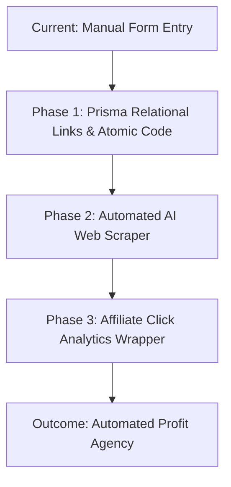

# 🏟️ Growth & Strategy: From Side-Project to Agency (Updated)

To build a professional agency and earn the "Big Turnout" you dream of, you need to transition from "making a website" to "operating a programmatic platform."

## 1. The Monetization Engine

Stop bleeding traffic directly to vendor domains with standard `<a href="https://kajabi.com">` links.

- **Affiliate Integration**: Every "Visit Official Site" button is a revenue stream. We must build a `/api/out/[platform]` route that records standard clicks, maps them to an analytics table in the DB, and redirects via your custom affiliate hoplink.
- **Premium Intelligence**: Offer the exact comparison JSON or a formatted PDF report via email wall. Currently, the `EmailRecipient` logic in your schema is unused in this flow. Leverage it.
- **Consultancy Quiz**: A "Which Platform" decision-tree quiz component that pushes high-intent leads to your agency.

## 2. The Content Flywheel

You've stated you want to upload daily. Here is the agency-grade workflow:

| Step             | Process                                         | System Implementation                                                                  |
| :--------------- | :---------------------------------------------- | :------------------------------------------------------------------------------------- |
| **Research**     | Automated web scraping via URL inputs.          | Pass Kajabi's changelog URL to your backend. AI parses JSON specs.                     |
| **Drafting**     | Auto-populating the UI Form.                    | The Admin merely _approves_ the AI-populated matrix, reducing time to 2 minutes.       |
| **Context**      | Semantic web linking via Prisma Relations.      | Because `Post` is linked to `Platform`, news seamlessly injects into comparison pages. |
| **Distribution** | Repurposing for Twitter, LinkedIn, Newsletters. | Auto-generate twitter threads based off `Comparison` facts.                            |

## 3. The "Managed" Admin

To manage at scale, you need a **Dynamic Entity Engine**:

- **The Sync Problem**: If you update Teachable's price from $119 to $129, it currently stays stale in specific `Fact` rows on comparison pages.
- **The Database Fix**: We must design `PlatformFeature` globally. The Facts comparison matrix should read from the Global Platform properties instead of creating unique fragmented `Fact` elements per comparison.

---

## 🌟 The "Agency Vision" Roadmap

#### Immediate Pivot:

Your focus has been aesthetics and basic CRUD. We must pivot immediately to building the internal APIs (the central brain). We will start by fixing the "Bugs Silence" (brittle parsers) and the God Components (monolithic files) so the codebase becomes clean enough to introduce the Scraper engine.
